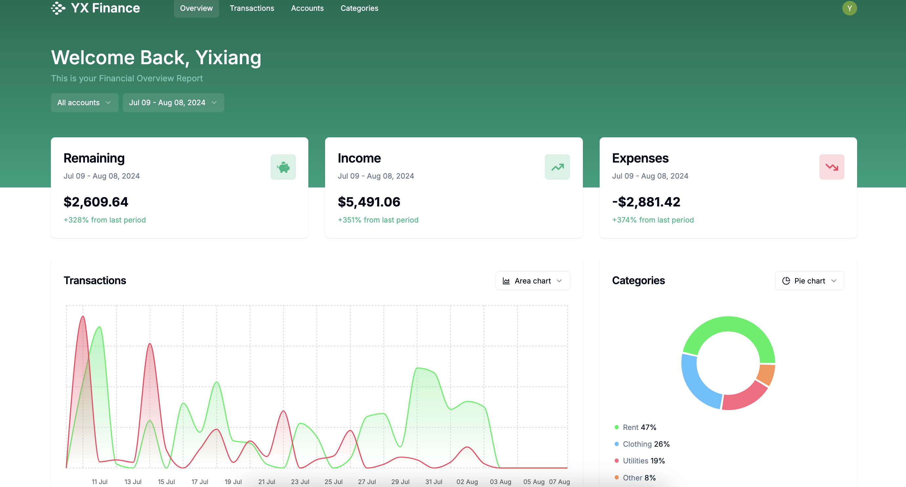

# YX Finance

## Overview

This full-stack finance tracking application is built with Next.js and deployed on Vercel. It features dynamic dashboards, customizable forms, secure authentication, and seamless data management.

## Features

- **Interactive Financial Dashboard**: Visualize income, expenses, and financial summaries with customizable chart types.
- **Account and Date Filters**: Refine data views by filtering transactions based on accounts and dates.
- **Detailed Transactions Table**: Manage transactions with advanced search, bulk delete, and CSV import functionalities.
- **Customizable Forms**: Easily add and manage financial data through intuitive forms and toggle options.
- **API Integration**: Secure API endpoints created with Hono.js, leveraging Tanstack Query for state management.
- **User Management**: Secure authentication with Clerk and user settings customization.
- **Scalable Backend**: Built with Next.js 14 and powered by PostgreSQL using Drizzle ORM on Neon.
- **Modern Frontend Design**: Styled with TailwindCSS and Shadcn UI for a responsive and clean user interface.

## Visit your dashboard here:

https://yx-finance.vercel.app/

